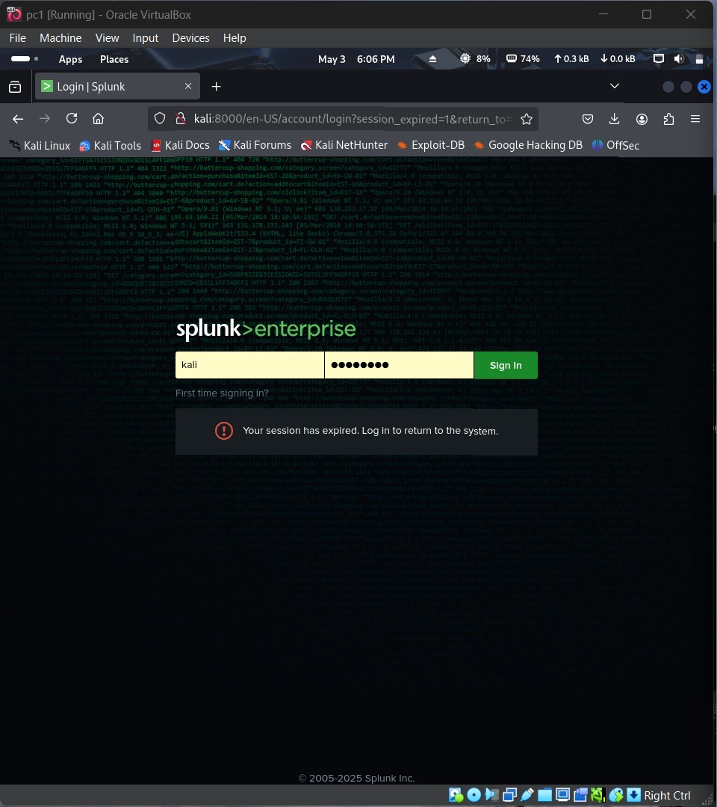
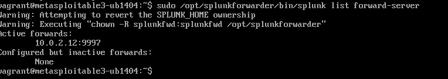
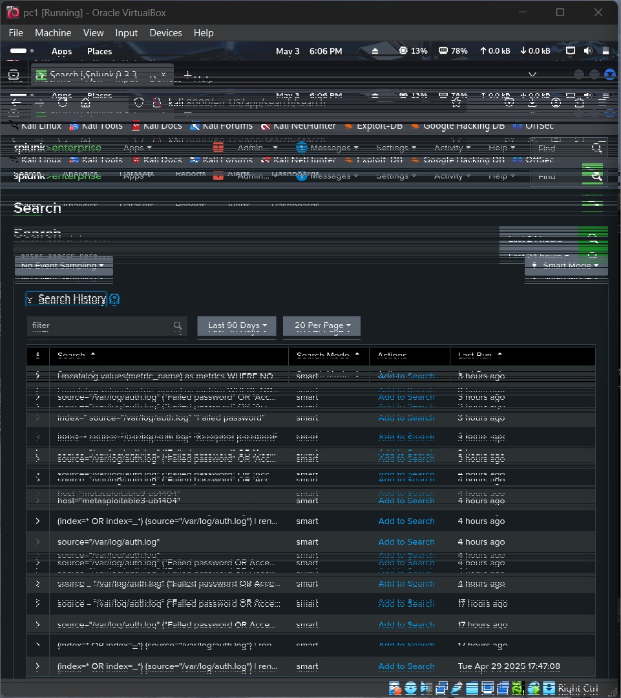
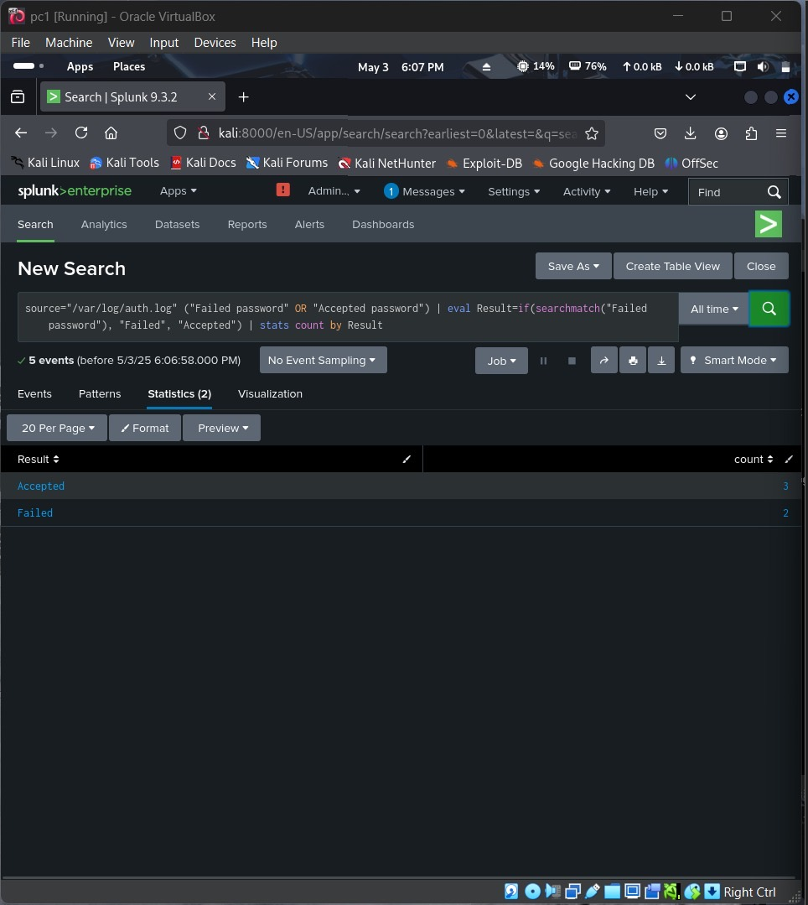
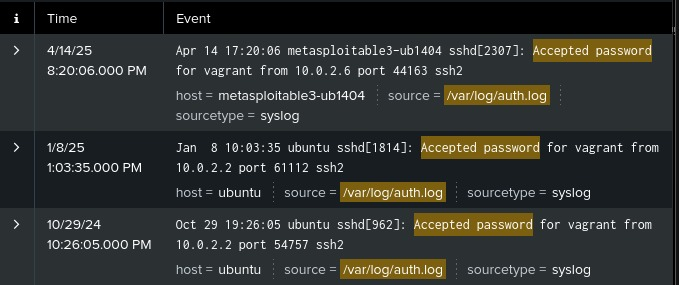
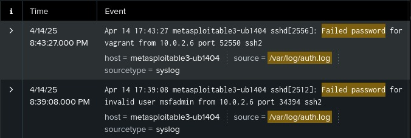
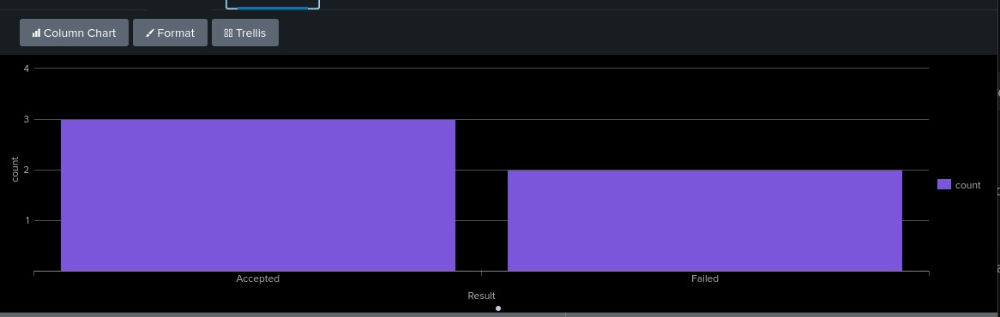

## 2. SIEM Dashboard Analysis (Phase 2)

### 2.1. Splunk UI Initialization & Forwarder Configuration

1. **Access Splunk Enterprise UI**: Launch a browser to `http://<Splunk_server>:8000`, log in with your credentials, and arrive at the Splunk Enterprise home screen.

<figure>
  
  <figcaption>Figure 7: Splunk Enterprise login screen.</figcaption>
</figure>

2. **Install and configure Universal Forwarder** on Metasploitable3 to ship `/var/log/auth.log` to our Splunk index.

<figure>
  
  <figcaption>Figure 8: Listing configured forward‑servers on Metasploitable3.</figcaption>
</figure>

3. **Verify Ingestion**: Run a simple search in the Splunk UI (e.g., `index=main sourcetype=syslog`) to confirm SSH authentication logs arrive.

<figure>
  
  <figcaption>Figure 9: Splunk search confirming ingestion of SSH authentication logs.</figcaption>
</figure>

### 2.2. Search, Statistics & Visualization### 2.2. Search, Statistics & Visualization

1. We executed a core Splunk search to classify each event as “Accepted” or “Failed”:

   ```spl
   source="/var/log/auth.log" ("Failed password" OR "Accepted password")
   | eval Result=if(searchmatch("Failed password"), "Failed", "Accepted")
   | stats count by Result
   ```

   <figure>
     
     <figcaption>Figure 9: Core Splunk search query for SSH authentication outcomes.</figcaption>
   </figure>
2. We reviewed sample events for each classification:

   <figure>
     
     <figcaption>Figure 10: Example of “Accepted password” events.</figcaption>
   </figure>
   <figure>
     
     <figcaption>Figure 11: Example of “Failed password” events.</figcaption>
   </figure>
3. Finally, we visualized the overall counts as a bar chart:

   <figure>
     
     <figcaption>Figure 12: Column chart of authentication outcomes.</figcaption>
   </figure>

