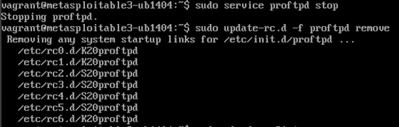
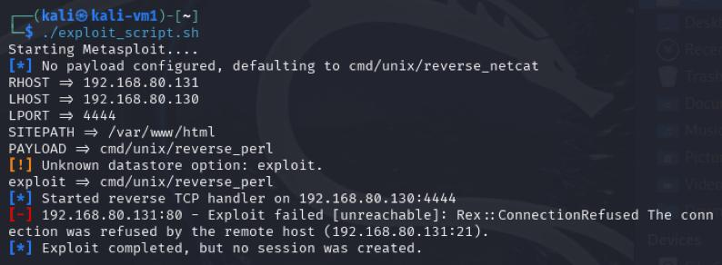
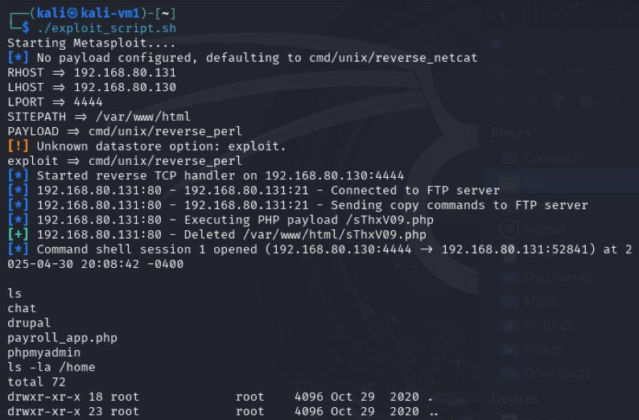

## 3. Defensive Strategy & Validation (Phase 3)

### 3.1. Overview

In Phase 3, we implemented a defensive strategy to mitigate the ProFTPD `mod_copy` vulnerability (CVE-2015-3306) that was previously exploited in Phase 1. The attack utilized Metasploit and a custom script on Kali Linux against Metasploitable3 running Ubuntu 14.04. Our objective in this phase was to remove the vulnerability and validate that the service could no longer be exploited.

### 3.2. Exploited Vulnerability Recap

* **Service:** ProFTPD FTP Server
* **Vulnerability:** `mod_copy` module allows remote code execution
* **Exploit Used:** `exploit/unix/ftp/proftpd_modcopy_exec` via Metasploit
* **Payload:** `cmd/unix/reverse_perl`
* **Attack Outcome (Before):** Remote shell access on the victim achieved.

### 3.3. Defensive Strategy

**Chosen Method:**

* Disabled the vulnerable ProFTPD service to remove the attack vector.
* Configured firewall rules to block incoming FTP traffic (port 21).

### 3.4. Defense Implementation Steps (on Metasploitable3)

1. **Disable ProFTPD Service**

   <figure>
     
     <figcaption>Figure 14: Disabling ProFTPD to remove the vulnerable service.</figcaption>
   </figure>
2. **Block FTP Port 21**

   <figure>
     
     <figcaption>Figure 15: Configuring UFW to deny incoming traffic on port 21.</figcaption>
   </figure>

### 3.5. Validation and Testing

1. **Re-Attempt Exploit**

   <figure>
     
     <figcaption>Figure 16: Post-defense exploit attempt showing connection refused.</figcaption>
   </figure>
2. **Network Scan**

   <figure>
     
     <figcaption>Figure 17: Nmap scan showing port 21 closed following defense.</figcaption>
   </figure>

### 3.6. Before-and-After Comparison

* **Before Defense**

  <figure>
    
    <figcaption>Figure 18: Before defense — ProFTPD running, port 21 open, exploit successful.</figcaption>
  </figure>
* **After Defense**

  <figure>
    
    <figcaption>Figure 19: After defense — ProFTPD stopped, port 21 closed, exploit failed.</figcaption>
  </figure>

### 3.7. Conclusion

By applying a defense-in-depth strategy—disabling ProFTPD and blocking the FTP port—we successfully removed the ProFTPD `mod_copy` vulnerability on Metasploitable3. Re-testing confirmed the service could no longer be exploited.

